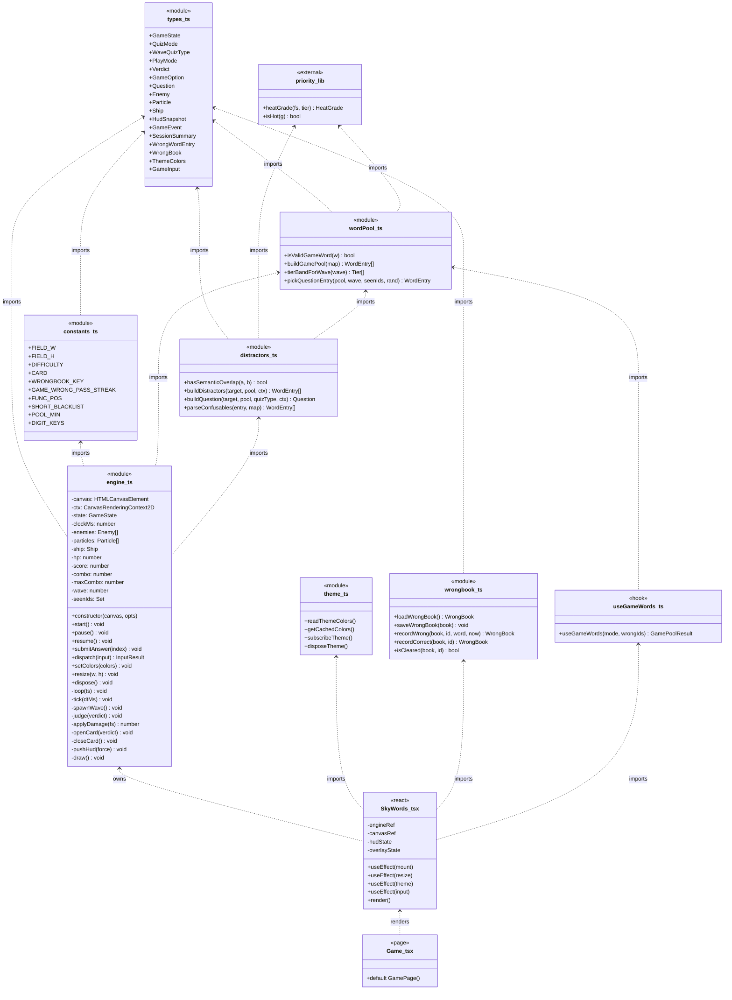
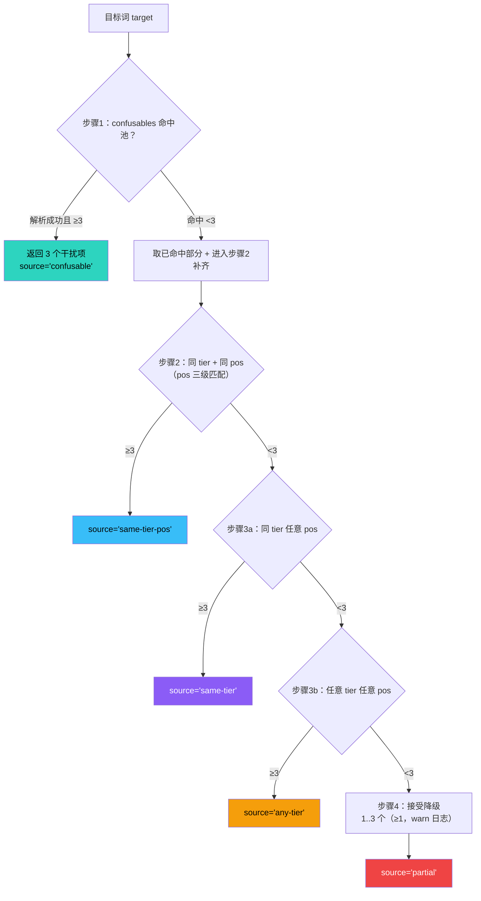
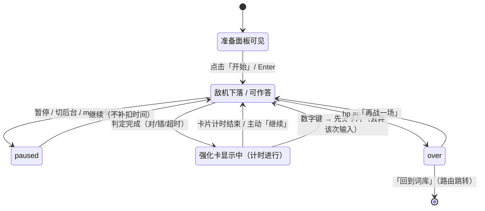
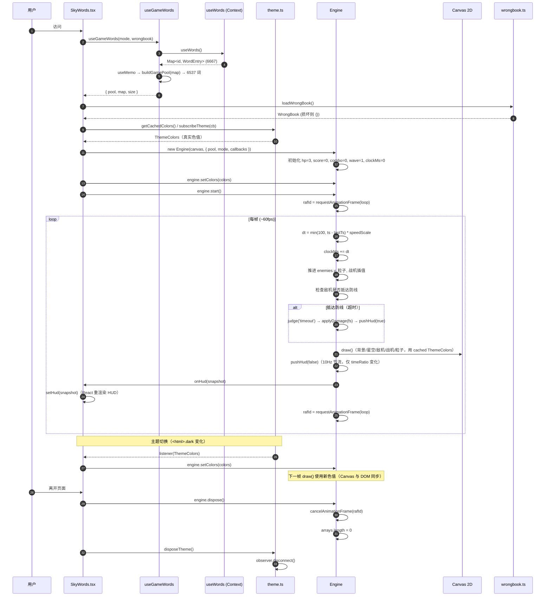
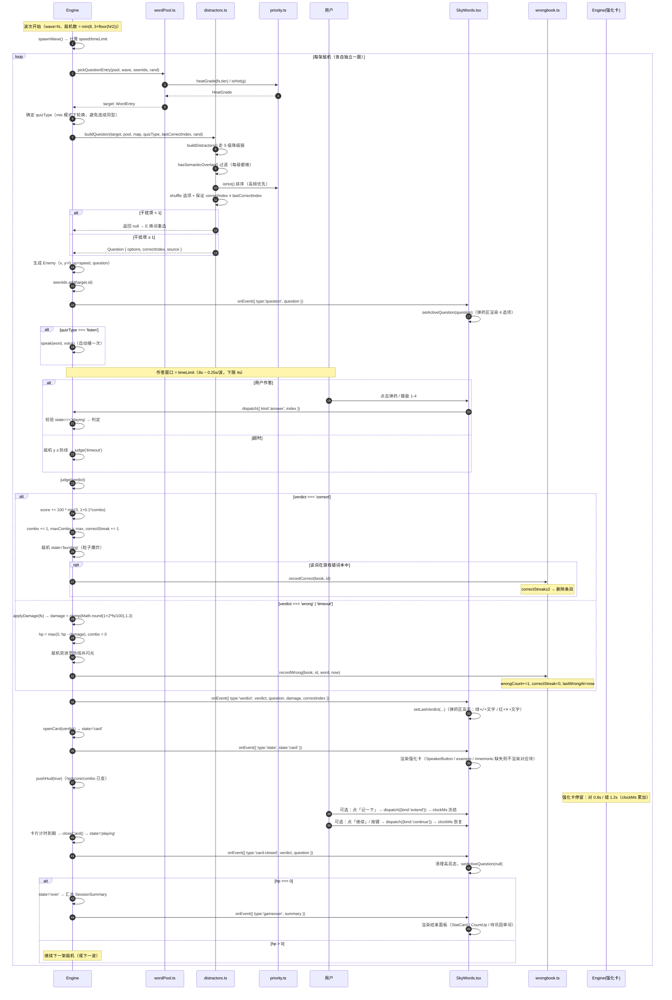
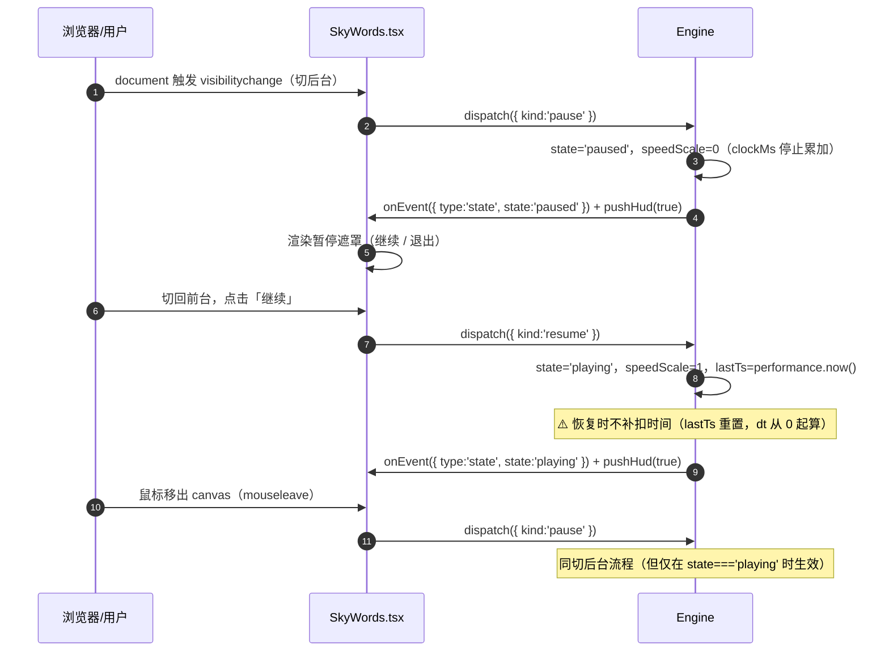
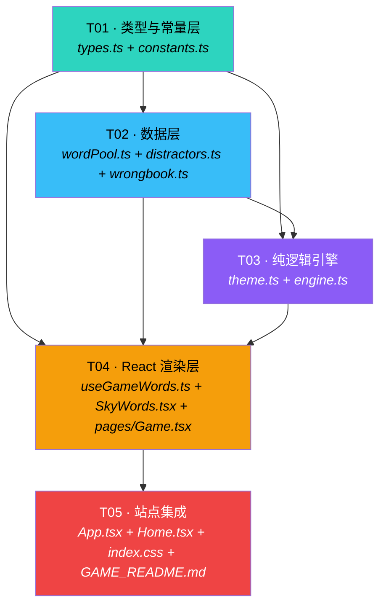

# 架构设计 · 词战长空 · SkyWords

> 版本 **v1.0** ｜ 架构师：高见远 ｜ 状态：待工程师（寇豆码）实施
> 输入依据：`docs/PRD-skywords.md`（v1.2 冻结）、`docs/FACTS-wordbank-verified.md`（实测档案，技术事实唯一依据）、`docs/HANDOFF-to-architect.md`（已拍板决策）
> 归属项目：词忆 CET（`cetyi-cet-vocab/`，GitHub Pages 静态站点，HashRouter）

---

## 0. 结论速览（TL;DR）

| 项 | 结论 |
|----|------|
| 渲染架构 | **Canvas 2D 单层 + DOM 绝对定位覆盖层**（HUD / 弹药区 / 强化卡 / 结束面板 / 暂停遮罩全为 DOM） |
| 引擎形态 | `engine.ts` 为**纯逻辑类，零 React、零 DOM 依赖**（只持有 canvas ctx 引用用于绘制），可单测 |
| 状态隔离 | 高频实体位置 → `engine` 私有字段；HUD 数值 → React `useState`，**仅在「判定 / 扣血 / 波次切换」等离散事件时推送**，绝不每帧 setState |
| 引擎→React 通信 | 引擎通过**注入的回调 `onHudChange` / `onEvent`** 推送；React 侧用 `useRef` 存引擎实例，回调内做节流合并 |
| 文件数 | 新增 **9 个** + 修改 **3 个** + 文档 **1 个**（在原始 8 文件基础上新增 `theme.ts` 拆分取色职责，理由见 §2.2） |
| 任务数 | **5 个**（T01 基础设施 → T02 数据层 → T03 纯逻辑引擎 → T04 React 渲染层 → T05 路由集成 + 文档） |
| 新增依赖 | **无**（P2-7：纯 Canvas 2D，不引入游戏引擎/物理库） |
| SRS 联动 | **不做**。游戏对 `cetyi.v1` 严格只读（D4 / P0-19 / P2-8） |

---

# Part A · 系统设计

## 1. 实现方案总览

### 1.1 核心挑战与对策

| # | 技术挑战 | 对策（本设计的核心价值） |
|---|---------|------------------------|
| C1 | **Canvas 不解析 CSS 变量**，`ctx.fillStyle = 'hsl(var(--primary))'` 无效 | 独立模块 `theme.ts`：`getComputedStyle` 读取真实值 + 模块级缓存 + `MutationObserver` 监听 `<html>` class 变化自动失效（详见 §4.1） |
| C2 | 每帧推进实体位置，但 HUD 需 React 渲染 → 每帧 setState 会拖垮性能 | **三层状态分离 + 事件驱动推送 + rAF 内微节流**（详见 §4.2） |
| C3 | `erasableSyntaxOnly` 禁 enum；`verbatimModuleSyntax` 强制 `import type`；`noUnusedLocals/Parameters` 报错 | 全部状态用**联合字面量类型**；所有类型导入显式 `import type`；回调签名避免未用参数（详见 §3、§9.4） |
| C4 | `confusables` 覆盖率仅 **0.39%（33/6667）** | 设计 **5 级降级链**，步骤 2（同 tier 同 pos）承担 **99.6% 的主路径**，步骤 1 仅作"锦上添花"（详见 §4.4） |
| C5 | 词池含超高频功能词（`i/a/and/be/can/do/of`），产出送分垃圾题 | `wordPool.ts` 三级过滤（pos 功能词性 + 显式黑名单 + `len≤2`），**`len≥3` 一律不因长度剔除**（详见 §4.5） |
| C6 | 双错词本并存，阈值不一致（游戏 2 次 / 站点 3 次） | **刻意设计，保留分离**（隔离优先于一致），README 显式说明（详见 §4.6） |
| C7 | 四路输入（鼠标/触摸/方向键/数字键）易冲突；强化卡期间数字键应先关卡片 | **输入状态机**：所有输入走统一 `dispatch(input)`，由当前 `GameState` 决定是否消费（详见 §4.7） |
| C8 | `requestAnimationFrame` / 事件监听 / Observer 未清理 → 内存泄漏 | **显式清理清单**（详见 §4.8） |
| C9 | 静态站 HashRouter，`#/game` 需站内打开且刷新不 404 | 并入现有 `Routes`；`/game` 加入 `immersive` 白名单（D5）；走 `lazy()` 懒加载 |
| C10 | 暂停时不能补扣时间（公平性） | 引擎用**累加式游戏时钟 `clockMs`**（暂停时不推进），所有计时基于它，而非 `Date.now()` |

### 1.2 渲染架构：Canvas 分层 + DOM 覆盖

采用**单 Canvas 层 + DOM 覆盖层**（不做多 Canvas 分层——星空/实体/粒子用同一 ctx 按序绘制即可，多 Canvas 的合成开销在移动端反而更大）。

```
┌─────────────────────────── .game-root (relative, aspect-[9/16] max-w-4xl mx-auto) ───────────┐
│                                                                                               │
│  ┌── Layer 1: <canvas> (absolute inset-0, z-0) ──────────────────────────────────────────┐   │
│  │  绘制顺序（同一次 rAF 内）：                                                            │   │
│  │  ① 背景填充 (theme.background)                                                          │   │
│  │  ② 星空星点 (theme.gradA/B/C，低速视差)                                                 │   │
│  │  ③ 防线 (theme.destructive 虚线)                                                        │   │
│  │  ④ 敌机气泡 (theme.card 底 + theme.primary 描边 + 单词文字)                              │   │
│  │  ⑤ 倒计时环 (theme.primary → 末 2s theme.destructive)                                   │   │
│  │  ⑥ 战机组 (theme.primary + 发光)                                                        │   │
│  │  ⑦ 粒子/弹道/爆炸 (theme.gradA/B/C)                                                     │   │
│  │  ⚠️ 文字用 ctx.font 手动指定，不依赖 Canvas 内 CSS                                       │   │
│  └────────────────────────────────────────────────────────────────────────────────────────┘   │
│                                                                                               │
│  ┌── Layer 2: HUD (absolute top-0 inset-x-0 z-10, .glass-card DOM) ─────────────────────┐   │
│  │  ❤️×hp | WAVE n | SCORE 4,200 | 🔥 COMBO ×5 | ⏸                                        │   │
│  └────────────────────────────────────────────────────────────────────────────────────────┘   │
│                                                                                               │
│  ┌── Layer 3: 弹药区 (absolute bottom-0 inset-x-0 z-10, DOM) ────────────────────────────┐   │
│  │  4 个按钮 (grid-cols-2 sm:grid-cols-4, 每个 ≥44×44px, .font-word)                       │   │
│  └────────────────────────────────────────────────────────────────────────────────────────┘   │
│                                                                                               │
│  ┌── Layer 4: 覆盖层 (absolute inset-0 z-20, 按 state 条件渲染) ─────────────────────────┐   │
│  │  state==='ready'  → 准备/模式选择面板                                                  │   │
│  │  state==='paused' → 暂停遮罩 + 继续/退出                                               │   │
│  │  state==='card'   → 记忆强化卡（答案/解析/重播/记一下）                                 │   │
│  │  state==='over'   → 结束面板（战果统计 + 待巩固单词 + 两个按钮）                         │   │
│  └────────────────────────────────────────────────────────────────────────────────────────┘   │
└───────────────────────────────────────────────────────────────────────────────────────────────┘
```

**为什么 HUD/弹药区用 DOM 而非 Canvas 绘制**：
1. 无障碍硬要求（`aria-label`、`Tab` 遍历、`Enter` 激活、`≥44px` 热区、焦点描边）**只有 DOM 能原生满足**（P0-14）；
2. 主题切换自动跟随（DOM 用 `bg-card` / `--border`，零成本）；
3. HUD 数值用 React 渲染天然支持 `CountUp` 动画。

### 1.3 模块划分与职责边界

| 模块 | 层 | 职责 | 依赖 |
|------|----|------|------|
| `src/game/types.ts` | 纯类型 | 全部游戏域类型与常量类型（**零运行时**） | `@/lib/types`（`WordEntry`） |
| `src/game/constants.ts` | 纯常量 | 难度曲线表、分数/扣血常量、存储键、输入映射表 | `types.ts` |
| `src/game/theme.ts` | DOM 适配 | CSS 变量 → Canvas 颜色值；缓存 + `MutationObserver` 刷新 | 无（只碰 `document`） |
| `src/game/wordPool.ts` | 纯逻辑 | 词池过滤（§4.1）+ 难度池分层 + 出题选词 | `types.ts`、`@/lib/priority` |
| `src/game/distractors.ts` | 纯逻辑 | 干扰项生成 5 级降级链 + 语义重叠过滤 + 位置去重 | `types.ts`、`@/lib/priority`、`wordPool.ts` |
| `src/game/wrongbook.ts` | 存储 | 读写 `cetyi.game.wrongbook.v1`，连对 2 次移出（**唯一触碰存储的模块**） | `types.ts` |
| `src/game/engine.ts` | **纯逻辑** | 游戏主循环、实体推进、判定、扣血、波次、暂停；**无 React、无 JSX** | `types.ts`、`constants.ts`、`wordPool.ts`、`distractors.ts` |
| `src/game/useGameWords.ts` | React Hook | `useWords()` → `useMemo` 派生过滤后词池（**不加载**） | `@/hooks/useWords`、`wordPool.ts` |
| `src/game/SkyWords.tsx` | React 视图 | Canvas 挂载、rAF 驱动、HUD/弹药/强化卡/结束面板、输入绑定、生命周期清理 | `engine.ts`、`theme.ts`、`wrongbook.ts`、`useGameWords.ts` |
| `src/pages/Game.tsx` | React 页面 | 薄壳：仅 `<SkyWords />` + 布局容器，供 `lazy()` 加载 | `SkyWords.tsx` |

**边界原则**：
- **`engine.ts` 不 import 任何 React**，也不 import `theme.ts`（颜色在绘制时由外部传入的 `ThemeColors` 提供）。这样引擎可被纯 Node 单测（未来）。
- **`theme.ts` 是唯一碰 `getComputedStyle` 的模块**，`SkyWords.tsx` 只消费其结果。
- **`wrongbook.ts` 是唯一碰 `localStorage` 的模块**，便于审计"只新增 `cetyi.game.*` 键"（P0-19）。
- **`wordPool.ts` / `distractors.ts` 是纯函数**，输入输出均为普通数据，无副作用、无时间依赖（`now` 由参数注入），最易测试。

---

## 2. 文件清单

### 2.1 完整清单（相对仓库根目录）

| # | 路径 | 类型 | 说明 |
|---|------|------|------|
| 1 | `src/game/types.ts` | 🆕 新增 | 游戏域全部类型定义（无运行时代码） |
| 2 | `src/game/constants.ts` | 🆕 新增 | 难度曲线、分数、存储键、输入映射等常量 |
| 3 | `src/game/theme.ts` | 🆕 新增 | CSS 变量取色 + 缓存 + MutationObserver |
| 4 | `src/game/wordPool.ts` | 🆕 新增 | 词池过滤（§4.1）+ 难度池构建 + 选词 |
| 5 | `src/game/distractors.ts` | 🆕 新增 | 干扰项 5 级降级链 + 语义重叠过滤 |
| 6 | `src/game/wrongbook.ts` | 🆕 新增 | 游戏错词本读写（连对 2 次移出） |
| 7 | `src/game/engine.ts` | 🆕 新增 | 纯逻辑引擎（主循环/实体/判定/扣血/波次） |
| 8 | `src/game/useGameWords.ts` | 🆕 新增 | 词池派生 Hook（`useMemo`，不加载） |
| 9 | `src/game/SkyWords.tsx` | 🆕 新增 | React 渲染层（Canvas + DOM 覆盖 + 生命周期） |
| 10 | `src/pages/Game.tsx` | 🆕 新增 | 页面薄壳（供 `lazy()` 加载） |
| 11 | `src/App.tsx` | ✏️ 修改 | 路由 + `immersive` 白名单 + `NAV` + `grid-cols-7` |
| 12 | `src/pages/Home.tsx` | ✏️ 修改 | 右侧操作列末尾追加游戏入口卡 |
| 13 | `src/index.css` | ✏️ 修改 | 新增 `.game-root` / 游戏专用 keyframes（含 reduce-motion 降级） |
| 14 | `GAME_README.md` | 📄 新增文档 | 玩法说明 + 双错词本差异 + 只读声明 |

> 统计：**新增代码 10 个** + **修改 3 个** + **文档 1 个**。

### 2.2 对原始需求建议文件清单的调整及理由

原始需求建议 8 个文件：`src/pages/Game.tsx`、`src/game/{SkyWords.tsx, engine.ts, wordPool.ts, distractors.ts, wrongbook.ts, types.ts, useGameWords.ts}`。

| 调整 | 内容 | 理由 |
|------|------|------|
| **新增 `constants.ts`** | 把难度曲线参数表、分数常量、存储键、输入映射从 `engine.ts` 中抽出 | §7 难度参数表是 PRD 的独立交付物，抽成常量表便于**逐行对照 PRD 核验**；也避免 `engine.ts` 过长 |
| **新增 `theme.ts`** | 把「CSS 变量取色 + MutationObserver」独立成模块 | 这是**最容易踩坑、最难内联调试**的部分（§4.1），独立后单文件即可审查；同时让 `engine.ts` 保持"纯逻辑、不碰 DOM"的清爽边界 |
| **新增 `src/pages/Game.tsx` 与 `src/game/SkyWords.tsx` 分离**（保持原始建议） | `pages/Game.tsx` 是懒加载入口薄壳，`SkyWords.tsx` 是游戏本体 | 与站内既有模式一致（`lazy(() => import('@/pages/Xxx'))`）；`pages/` 目录只放路由级组件 |
| **不合并 `wordPool.ts` 与 `useGameWords.ts`** | 保持分离 | `wordPool.ts` 是纯函数（可单测、被 `distractors.ts` 复用），`useGameWords.ts` 是 React Hook（含 `useMemo`）。合并会让纯逻辑被 React 污染，也违反"引擎无 React 依赖"的边界 |
| **不拆分 `engine.ts`** | 保持单文件 | 引擎内部状态高度耦合（实体位置、波次、判定、时钟），强拆会引入大量跨文件样板；单文件 + 清晰的分区注释（`// ---- 时钟 ----`）更实用 |

---

## 3. 数据结构与接口

### 3.1 核心类型定义（`src/game/types.ts`，真实可用）

> ⚠️ 全部符合 `erasableSyntaxOnly`（无 `enum` / 无参数属性 / 无 `namespace`）、`verbatimModuleSyntax`（类型导入用 `import type`）、`strict`、`noUnusedLocals`。

```ts
// src/game/types.ts
import type { WordEntry } from '@/lib/types';

// ---------------- 状态与模式（联合字面量，替代 enum） ----------------

/** 游戏状态机状态 */
export type GameState = 'ready' | 'playing' | 'paused' | 'card' | 'over';

/** 题型模式（含混合） */
export type QuizMode = 'en2zh' | 'zh2en' | 'listen' | 'mix';
/** 单波实际题型（混合模式下每波确定一个，不含 'mix' 本身） */
export type WaveQuizType = Exclude<QuizMode, 'mix'>;

/** 局内玩法模式：普通 / 专攻错词 */
export type PlayMode = 'normal' | 'wrongbook';

/** 判定结果 */
export type Verdict = 'correct' | 'wrong' | 'timeout';

// ---------------- 选项与出题 ----------------

/** 干扰项来源分级（用于埋点与 warn 日志） */
export type DistractorSource = 'confusable' | 'same-tier-pos' | 'same-tier' | 'any-tier' | 'partial';

export interface GameOption {
  /** 选项唯一键：en2zh 用候选词 id；zh2en/listen 用候选词 id */
  key: string;
  /** 展示文案（en2zh = 中文释义；zh2en/listen = 英文单词） */
  text: string;
  /** 是否为正确项 */
  correct: boolean;
}

/** 一道题（= 一架敌机） */
export interface Question {
  /** 目标词 id（小写拼写） */
  wordId: string;
  /** 目标词完整条目（强化卡直接用，避免二次查表） */
  entry: WordEntry;
  /** 本题题型 */
  quizType: WaveQuizType;
  /** 4 个选项（已 shuffle，可能少于 4 个但 ≥2） */
  options: GameOption[];
  /** 正确项在 options 中的索引 */
  correctIndex: number;
  /** 干扰项实际达标来源（埋点用） */
  source: DistractorSource;
}

// ---------------- 引擎实体 ----------------

/** 敌机（承载一道题） */
export interface Enemy {
  id: number;
  question: Question;
  x: number;      // 逻辑坐标（0..FIELD_W）
  y: number;      // 逻辑坐标（0..FIELD_H），自上而下增长
  vy: number;     // px/s
  size: number;   // 半径
  state: 'falling' | 'hit' | 'bursting';
  /** 命中/爆炸进度 0..1（用于缩放消散动画） */
  fx: number;
}

/** 粒子（纯视觉） */
export interface Particle {
  x: number; y: number;
  vx: number; vy: number;
  life: number;   // 剩余生命 0..1
  maxLife: number;
  color: string;  // 已解析的真实色值
  size: number;
  kind: 'spark' | 'debris' | 'ring';
}

/** 战机 */
export interface Ship {
  x: number;
  targetX: number; // 鼠标/触摸/方向键的目标位，逐帧插值跟随
}

// ---------------- HUD 快照（引擎 → React 的唯一数据通道） ----------------

/** HUD 数据快照：仅在离散事件时推送 */
export interface HudSnapshot {
  hp: number;
  wave: number;
  score: number;
  combo: number;
  maxCombo: number;
  /** 当前题剩余时间比例 0..1（倒计时环用，由 rAF 节流推送） */
  timeRatio: number;
  /** 是否处于最后 2s 危急态 */
  urgent: boolean;
}

/** 引擎向 React 抛出的一次性事件（不参与每帧渲染） */
export type GameEvent =
  | { type: 'state'; state: GameState }
  | { type: 'question'; question: Question; index: number }
  | { type: 'verdict'; verdict: Verdict; question: Question; damage: number; correctIndex: number }
  | { type: 'card-closed'; verdict: Verdict; question: Question }
  | { type: 'gameover'; summary: SessionSummary }
  | { type: 'wave'; wave: number }
  | { type: 'warn'; message: string };

/** 本局战果 */
export interface SessionSummary {
  score: number;
  maxCombo: number;
  killed: number;        // 击落敌机数 = 答对题数
  total: number;         // 总题数
  uniqueWords: number;   // 本局不同单词数
  accuracy: number;      // 0..1
  newWrongEntries: WrongWordEntry[];
}

// ---------------- 错词本 ----------------

export interface WrongWordEntry {
  word: string;          // 显示用原形
  wrongCount: number;    // 累计答错/超时次数
  lastWrongAt: number;   // 最近答错时间戳（ms，绝对时间）
  correctStreak: number; // 进入错词本后的连续答对次数
}

/** key = wordId（小写拼写） */
export type WrongBook = Record<string, WrongWordEntry>;

// ---------------- 主题色（Canvas 用真实色值） ----------------

export interface ThemeColors {
  background: string;
  card: string;
  primary: string;
  destructive: string;
  foreground: string;
  muted: string;
  border: string;
  gradA: string;
  gradB: string;
  gradC: string;
}

// ---------------- 输入 ----------------

/** 统一输入事件（四路输入归一） */
export type GameInput =
  | { kind: 'move'; x: number }        // 鼠标/触摸：绝对目标 X（逻辑坐标）
  | { kind: 'move-by'; dx: number }    // 方向键：相对位移（逻辑单位）
  | { kind: 'answer'; index: number }  // 数字键 / 点击弹药按钮（0..3）
  | { kind: 'pause' }
  | { kind: 'resume' }
  | { kind: 'replay' }                 // 听音辨词 🔊 重播
  | { kind: 'extend' }                 // 强化卡「记一下」
  | { kind: 'continue' };              // 强化卡「继续」

/** 输入角色：用于决定是否 consume（阻止页面滚动等） */
export interface InputResult {
  /** 事件是否已被游戏消费（true 时应 preventDefault） */
  consumed: boolean;
}

// ---------------- 引擎构造参数 ----------------

export interface EngineCallbacks {
  onHud: (snap: HudSnapshot) => void;
  onEvent: (ev: GameEvent) => void;
}

export interface EngineOptions {
  /** 过滤后的词池（普通模式用全量；专攻错词模式用错词池） */
  pool: WordEntry[];
  /** 错词池（专攻模式） */
  wrongPool?: WordEntry[];
  mode: PlayMode;
  quizMode: QuizMode;
  /** 初始设置 */
  reduceMotion: boolean;
  soundOn: boolean;
  voice: 'en-GB' | 'en-US';
  /** 初始错词本快照（读取一次，写入由 React 层调 wrongbook 完成） */
  wrongbook: WrongBook;
  callbacks: EngineCallbacks;
}
```

### 3.2 常量表（`src/game/constants.ts`）

```ts
// src/game/constants.ts
import type { QuizMode, WaveQuizType } from './types';

/** 逻辑坐标系（引擎内部用，与 CSS 像素解耦；绘制时按 canvas 尺寸缩放） */
export const FIELD_W = 400;
export const FIELD_H = 700;

/** 难度曲线（PRD §7，逐项对照，禁止自创阈值） */
export const DIFFICULTY = {
  speedStart: 40,        // px/s
  speedStep: 4,          // +4 px/s / 波
  speedMax: 140,         // px/s
  enemiesBase: 3,
  enemiesStepEvery: 2,   // 每 2 波 +1
  enemiesMax: 8,
  timeStart: 8.0,        // s
  timeStep: 0.25,        // −0.25 s / 波
  timeMin: 4.0,          // s
  optionsCount: 3,       // 干扰项数（始终 4 选项）
  scoreBase: 100,
  comboStep: 0.1,
  comboMax: 3.0,         // ×3 封顶
  hpStart: 3,
  hpMax: 5,
} as const;

/** 强化卡停留时长（s） */
export const CARD = {
  correctSec: 0.8,
  wrongSec: 1.2,         // 答错 +50%
} as const;

/** 错词本 */
export const WRONGBOOK_KEY = 'cetyi.game.wrongbook.v1';
/** 游戏错词本移出阈值（与站点 WRONG_PASS_STREAK=3 刻意不同，见 §4.6） */
export const GAME_WRONG_PASS_STREAK = 2;

/** 输入 */
export const MOVE_STEP = 36;          // 方向键单次位移（逻辑单位）
export const MOVE_SPEED = 12;         // 战机跟随插值速度（逻辑单位/帧系数）
export const DIGIT_KEYS: Record<string, number> = { '1': 0, '2': 1, '3': 2, '4': 3 };

/** 题型轮换表（混合模式；避免连续两波同型由引擎动态保证） */
export const ALL_TYPES: WaveQuizType[] = ['en2zh', 'zh2en', 'listen'];

/** 功能词性黑名单（PRD §4.1 主判据） */
export const FUNC_POS = ['art.', 'pron.', 'prep.', 'conj.', 'aux.', 'det.', 'int.', 'num.'] as const;

/** 显式短词黑名单（PRD §4.1，仅 23 个 len≤2 词中的功能词） */
export const SHORT_BLACKLIST = new Set([
  'a', 'ad', 'as', 'at', 'ax', 'be', 'by', 'do', 'go', 'he', 'hi', 'i',
  'if', 'in', 'it', 'me', 'my', 'no', 'of', 'oh', 'on', 'or', 'ox',
]);

/** 词池最小规模（低于此值放弃过滤并 warn，保可玩性优先） */
export const POOL_MIN = 20;

/** 题型 → 默认模式别名，供 UI 展示 */
export const QUIZ_MODE_LABELS: Record<QuizMode, string> = {
  en2zh: '英→中',
  zh2en: '中→英',
  listen: '听音辨词',
  mix: '混合模式',
};
```

### 3.3 模块依赖图（Mermaid）



### 3.4 关键对外函数签名（工程师直接照此实现）

```ts
// ---------- src/game/theme.ts ----------
/** 读取当前主题的真实色值（一次 getComputedStyle） */
export function readThemeColors(el?: HTMLElement): ThemeColors;
/** 取缓存（首次自动读取）；供 rAF 内高频调用，避免重复 getComputedStyle */
export function getCachedColors(): ThemeColors;
/** 订阅 <html> class 变化，返回 unsubscribe；重复订阅会合并为单例 observer */
export function subscribeTheme(listener: (c: ThemeColors) => void): () => void;
/** 组件卸载时释放单例 observer */
export function disposeTheme(): void;

// ---------- src/game/wordPool.ts ----------
/** 单个词是否可进入游戏词池（PRD §4.1 三级判据 + 反误杀保护） */
export function isValidGameWord(w: WordEntry): boolean;
/** useWords() 的 Map → 过滤后词池数组（不改动入参） */
export function buildGamePool(map: Map<string, WordEntry>): WordEntry[];
/** 按波次给出允许的 tier 集合（难度渐进） */
export function tierBandForWave(wave: number): Tier[];
/** 从池中选一道题的目标词（不重复优先 + 热度/难度加权） */
export function pickQuestionEntry(
  pool: WordEntry[],
  wave: number,
  seenIds: ReadonlySet<string>,
  rand: () => number,
): WordEntry | null;

// ---------- src/game/distractors.ts ----------
/** 两个词是否存在中文语义重叠（长度≥2 连续中文子串） */
export function hasSemanticOverlap(a: WordEntry, b: WordEntry): boolean;
/** 解析 confusables 字段 → 命中词池的词（未命中静默跳过） */
export function parseConfusables(entry: WordEntry, map: Map<string, WordEntry>): WordEntry[];
/** §4 五级降级链：返回干扰项数组（可能 1..3 个） */
export function buildDistractors(
  target: WordEntry,
  pool: WordEntry[],
  map: Map<string, WordEntry>,
  rand: () => number,
): { items: WordEntry[]; source: DistractorSource };
/** 组装完整题（含选项文案、shuffle、正确位去重） */
export function buildQuestion(
  target: WordEntry,
  pool: WordEntry[],
  map: Map<string, WordEntry>,
  quizType: WaveQuizType,
  lastCorrectIndex: number | undefined,
  rand: () => number,
): Question;

// ---------- src/game/wrongbook.ts ----------
export function loadWrongBook(): WrongBook;                 // 损坏 → 返回 {}
export function saveWrongBook(book: WrongBook): void;       // try/catch 静默失败
export function recordWrong(book: WrongBook, id: string, word: string, now: number): WrongBook;
export function recordCorrect(book: WrongBook, id: string): WrongBook; // 达标即删除 key
export function isInWrongBook(book: WrongBook, id: string): boolean;
/** 错词池 → WordEntry[]（过滤后，用于「专攻错词」） */
export function wrongPoolEntries(book: WrongBook, map: Map<string, WordEntry>): WordEntry[];
```

---

## 4. 技术难点逐条方案（核心交付）

### 4.1 Canvas 主题取色（C1）

**问题**：`ctx.fillStyle = 'hsl(var(--primary))'` 是无效色值（Canvas 不解析 CSS 变量，会静默保持上一次颜色或落到黑色）。

**方案：三层结构 = 读取 → 缓存 → 失效**

```ts
// src/game/theme.ts（实现要点，非完整代码）
import type { ThemeColors } from './types';

let cache: ThemeColors | null = null;
let observer: MutationObserver | null = null;
const listeners = new Set<(c: ThemeColors) => void>();

function readOnce(): ThemeColors {
  const cs = getComputedStyle(document.documentElement);
  // ⚠️ 关键：getPropertyValue 返回的是 "200 98% 32%" 这样的裸分量，必须自己包 hsl()
  const v = (name: string, fallback: string) => {
    const raw = cs.getPropertyValue(name).trim();
    return raw ? `hsl(${raw})` : fallback;
  };
  return {
    background:  v('--background', 'hsl(225 44% 7%)'),
    card:        v('--card', 'hsl(223 34% 10%)'),
    primary:     v('--primary', 'hsl(198.6 93.2% 59.8%)'),
    destructive: v('--destructive', 'hsl(6 55% 55%)'),
    foreground:  v('--foreground', 'hsl(213 30% 95%)'),
    muted:       v('--muted-foreground', 'hsl(215 18% 70%)'),
    border:      v('--border', 'hsl(220 26% 18%)'),
    gradA:       v('--grad-a', 'hsl(198.6 93.2% 59.8%)'),
    gradB:       v('--grad-b', 'hsl(258.3 89.7% 66.3%)'),
    gradC:       v('--grad-c', 'hsl(172.5 66.1% 50.4%)'),
  };
}
```

**缓存与失效规则（明确清单）**：

| 时机 | 动作 |
|------|------|
| 模块首次被调用 | `readOnce()` → 写 `cache` |
| rAF 每帧绘制前 | 只读 `cache`（**零 `getComputedStyle` 调用**，这是性能关键） |
| `<html>` 的 `class` 属性变化（`.dark` 增删） | `MutationObserver` 触发 → `readOnce()` 重建 `cache` → 调用 `listeners` 中的回调（`SkyWords` 内 `engineRef.current?.setColors(cache)`） |
| `SkyWords` 组件卸载 | `observer?.disconnect()`（在 `disposeTheme()` 内） |

**Observer 实现要点**：
```ts
function ensureObserver() {
  if (observer) return;
  observer = new MutationObserver(() => {
    cache = readOnce();
    listeners.forEach((fn) => fn(cache!));
  });
  // 只监听 class 属性，避免无关 DOM 变更触发
  observer.observe(document.documentElement, { attributes: true, attributeFilter: ['class'] });
}
```

**为什么不用 `matchMedia('(prefers-color-scheme: dark)')` 代替 Observer**：站点主题由 `settings.dark` 三态（`light`/`dark`/`auto`）驱动，`auto` 时才跟随系统。Observer 监听的是**最终结果**（`.dark` 类），因此对三种设置**全覆盖**，是唯一正确的监听点。

**`ctx.font` 的同类问题**：Canvas 字体也拿不到 Tailwind 的 `font-family`。因此 `.font-word`（Georgia 衬线）在 Canvas 侧需**硬编码等价字体栈字符串**（与 `index.css` 的 `.font-word` 保持一致），并在 `constants.ts` 中集中定义：
```ts
export const CANVAS_FONT_WORD = "Georgia, 'Times New Roman', 'Songti SC', SimSun, serif";
export const CANVAS_FONT_UI = "-apple-system, BlinkMacSystemFont, 'Segoe UI', Roboto, 'PingFang SC', sans-serif";
```

**`devicePixelRatio` 处理**：Canvas 需按 DPR 放大后 `ctx.scale(dpr, dpr)`，否则高分屏模糊。逻辑坐标系固定 `FIELD_W/FIELD_H`（§3.2），绘制时统一用 `ctx.save() → ctx.scale(sx, sy) → 按逻辑坐标绘制 → ctx.restore()`。

---

### 4.2 性能：避免每帧 setState（C2）

**问题**：引擎每帧（~60fps）推进实体位置。如果 `hp/score/combo` 也每帧 `setState`，React 会重建整棵 HUD 子树 60 次/秒 → 移动端掉帧。

**方案：三层状态分离 + 事件驱动推送 + rAF 内微节流**

| 状态类别 | 存放位置 | 更新频率 | 更新方式 |
|---------|---------|---------|---------|
| **A. 纯视觉高频状态**（敌机/战机/粒子坐标、爆炸进度、弹道） | `engine` 私有字段（**从不进 React**） | 每帧 | 直接在 rAF 内改 + `ctx` 绘制 |
| **B. 离散数值状态**（`hp` / `score` / `combo` / `maxCombo` / `wave`） | React `useState<HudSnapshot>` | **仅离散事件**（判定、扣血、波次切换、得分） | 引擎调 `callbacks.onHud(snapshot)` → React `setState` |
| **C. 连续变化但需渲染的进度状态**（倒计时环 `timeRatio`） | React `useState`，**由 rAF 微节流推送** | 最多 **10 Hz**（每 100ms 一次），且仅在比值变化 > 0.5% 时推送 | 引擎内 `pushHud()` 内做节流判断 |

**关键实现细节**：

```ts
// engine.ts 内
private hudDirty = false;
private lastHudPushMs = 0;
private lastTimeRatio = 1;

/** 离散事件后立即推送（force=true）；rAF 中按节流推送（force=false） */
private pushHud(force: boolean) {
  const snap: HudSnapshot = {
    hp: this.hp, wave: this.wave, score: this.score,
    combo: this.combo, maxCombo: this.maxCombo,
    timeRatio: this.timeRatio, urgent: this.timeRatio <= 0.25,
  };
  if (force) {
    this.callbacks.onHud(snap);
    this.lastHudPushMs = this.clockMs;
    this.lastTimeRatio = snap.timeRatio;
    return;
  }
  // 非强制：10Hz 节流 + 变化阈值
  const changed = Math.abs(snap.timeRatio - this.lastTimeRatio) > 0.005;
  if (changed && this.clockMs - this.lastHudPushMs >= 100) {
    this.callbacks.onHud(snap);
    this.lastHudPushMs = this.clockMs;
    this.lastTimeRatio = snap.timeRatio;
  }
  // ⚠️ 无论是否推送，timeRatio 危急态跨越边界时必须强制推一次
  if (snap.urgent !== this.lastUrgent) { this.lastUrgent = snap.urgent; this.callbacks.onHud(snap); }
}
```

| 触发点 | `pushHud(force)` |
|-------|-----------------|
| `judge()` 判定完成（hp/score/combo 变化） | `pushHud(true)` |
| 波次切换 | `pushHud(true)` |
| 游戏开始 / 恢复 / 重置 | `pushHud(true)` |
| rAF 每帧（仅推进 `timeRatio`） | `pushHud(false)`（10Hz 节流） |
| 危急态（最后 2s）跨越 | 强制推一次（避免按钮/文字状态滞后） |

**React 侧的配合**：
- `SkyWords.tsx` 用 `useState<HudSnapshot>` 存 HUD；`onHud` 回调直接 `setHud(snap)`。
- `useCallback` 包裹所有回调，避免引擎持有过期闭包。
- 引擎实例存 `useRef<Engine | null>(null)`，**不作为 state**（避免 body 重建）。
- HUD 子组件用 `React.memo` 包裹（HUD 只有 6 个数字，`memo` 后 10Hz 推送无压力）。
- **强化卡/结束面板的显示数据走「事件」通道**（`onEvent`），因为它们切换频率极低（每题一次），可用普通 state 表达。

**为什么倒计时环不画在 Canvas 里**：Canvas 画环意味着 `timeRatio` 完全不出引擎，性能最优。但 PRD §9.1 要求倒计时「进入最后 2s 变 `--destructive` 并 pulse」——`pulse` 是 CSS 动画，Canvas 内需自行实现动画曲线；且无障碍要求倒计时数字可被读屏获取。**折中**：环本身画在 Canvas（视觉），**同时**在 HUD DOM 中渲染一个 `aria-label="剩余 6.2 秒"` 的隐藏文本节点供读屏；`urgent` 状态由引擎推送驱动 DOM 颜色变化。这样兼顾性能与无障碍。

---

### 4.3 TypeScript 严苛限制（C3）

| 规则 | 后果 | 本设计的统一规避写法 |
|------|------|--------------------|
| `erasableSyntaxOnly: true` | 禁 `enum` / `const enum` / 构造函数参数属性 / `namespace` / `declare`（不含 `declare global`） | 全部状态用**联合字面量类型**：`type GameState = 'ready' \| 'playing' \| 'paused' \| 'card' \| 'over'`；类字段显式声明 + 构造函数体内赋值 |
| `verbatimModuleSyntax: true` | 类型导入必须 `import type` | **统一规则：凡只用于类型位置的导入，一律 `import type { X } from '...'`**；值导入（函数/常量）用普通 `import`。混用时写成两条语句 |
| `noUnusedLocals` / `noUnusedParameters` | 未使用的局部变量/参数 → **报错** | 回调签名里用不到的参数以 `_` 前缀（如 `(_ev: GameEvent) => {}`）；引擎内部 `dispatch` 的参数一定被消费 |
| `noFallthroughCasesInSwitch` | `case` 穿透报错 | 每个 `case` 必须 `break`/`return`；用 `default: return;` 兜底 |
| `noUncheckedSideEffectImports` | 副作用导入需被识别 | `import './x.css'` 类导入已由 `vite/client` 类型支持，正常 |
| `strict: true` | 严格空值检查 | `WordEntry` 的可选字段（`uk/us/pos/fs/example/mnemonic/confusables`）**一律先判空再使用**，不靠 `!` 断言 |
| `target: ES2022` + `lib: [ES2022, DOM, DOM.Iterable]` | — | 可用 `ResizeObserver` / `structuredClone` / `Array.prototype.at` / 逻辑赋值；**不可用** `Object.groupBy`（ES2024）等越界 API |

**类字段声明的正确写法**（`engine.ts` 会大量用到）：

```ts
// ❌ 禁止（erasableSyntaxOnly 报错）
class Engine { constructor(private canvas: HTMLCanvasElement) {} }

// ✅ 正确
export class Engine {
  private canvas: HTMLCanvasElement;
  private ctx: CanvasRenderingContext2D;
  private state: GameState = 'ready';
  // ...
  constructor(canvas: HTMLCanvasElement, opts: EngineOptions) {
    this.canvas = canvas;
    const ctx = canvas.getContext('2d');
    if (!ctx) throw new Error('Canvas 2D context 不可用'); // strict 下必须判空
    this.ctx = ctx;
    // ...
  }
}
```

**高频踩坑提醒（工程师务必注意）**：
- `import { type X, fn }` 混写形式**在本项目禁用**——`verbatimModuleSyntax` 下虽然合法，但团队规范统一为「类型走 `import type`，值走 `import`」两条独立语句，避免审查时看漏。
- `useState<HudSnapshot | null>(null)` 后所有访问必须判空（`strict`）。
- 事件处理函数里 `React.KeyboardEvent` 等类型必须 `import type { KeyboardEvent } from 'react'`（或直接用全局 `KeyboardEvent`，注意区分 DOM 全局类型与 React 类型——**本设计统一用全局 `KeyboardEvent` / `TouchEvent` / `MouseEvent`，因为监听直接挂在 `window`/`element` 上**）。

---

### 4.4 `confusables` 覆盖率 0.39%（C4）——干扰项 5 级降级链

**问题**：全库仅 **33 个词（0.39%）** 带 `confusables`。PRD §4 步骤 1 的"易混词优先"实际只有 33 个词能命中，**99.6% 的出题走不到这条路径**。

**方案：5 级降级链，每级都必须重新做语义重叠过滤**



**各级详细规则**：

| 级 | 来源 | 筛选条件 | 预期命中率 |
|----|------|---------|-----------|
| **1** | `confusables` | `split(/[\s（(]/)[0].toLowerCase()` 解析首 token → 回查池 Map → 未命中**静默跳过** | 33/6667 词，**<1%** |
| **2（主路径）** | 同 `tier` + 同 `pos` | `pos` 三级匹配：① 精确相等 → ② 取 `/` 前第一段主词性相同（`adj./n.` → `adj.`）→ ③ 忽略 pos | **~96%+ 从本级起生效** |
| **3a** | 同 `tier` 任意 `pos` | 放宽 pos 维度 | 补充 |
| **3b** | 任意 `tier` 任意 `pos` | 完全放宽 | 补充 |
| **4** | 降级接受 | 1..3 个（**≥1 即可出题**） | 极端兜底 |

**每级都必须叠加两个硬过滤（不可省）**：

```ts
// ① 语义重叠过滤（严禁两个选项都算对）
function hasSemanticOverlap(a: WordEntry, b: WordEntry): boolean {
  // 长度 ≥2 的连续中文子串匹配
  const CJK = /[\u4e00-\u9fa5]{2,}/g;
  const gramsA = new Set<string>();
  for (const m of a.meanings) for (const g of m.match(CJK) ?? []) gramsA.add(g);
  // 若 a 的某个中文词是 b 的某个中文词的子串（或反之），判定重叠
  for (const m of b.meanings) {
    for (const g of m.match(CJK) ?? []) {
      if (gramsA.has(g)) return true;
      for (const ga of gramsA) if (ga.includes(g) || g.includes(ga)) return true;
    }
  }
  // ② 首义项包含校验（选项只展示 meanings[0]）
  const t0 = a.meanings[0] ?? '';
  const c0 = b.meanings[0] ?? '';
  return t0.length > 0 && c0.length > 0 && (t0 === c0 || t0.includes(c0) || c0.includes(t0));
}
```

**排序（步骤 4：高频优先保留）**：
```ts
// 在每一级的候选集中，按如下顺序取前 3：
// ① isHot(heatGrade(w.fs, w.tier)) === true 优先
// ② heatGrade 档位高者优先（S > A > B > C > D）
// ③ fs 降序
// ④ rand() 打破并列
```
⚠️ **绝对不许用 "S 档" 筛词**（D6）：S 档全库仅 1 词，会得到空集。统一用 `isHot()`（S∨A）口径。

**选项数量兜底**：最终选项数 = `1 + distractors.length`；若 `< 4` 但 `≥ 2`，正常出题并 `onEvent({type:'warn'})`；若 `distractors.length === 0`，则**换词**（`pickQuestionEntry` 重选目标词），不产出单选题。

**「专攻错词」特例**：若错词池 `< 4`，干扰项从**全量词池**按同一降级链补齐（保证 4 选项）。

---

### 4.5 词池过滤（C5）——`useGameWords` 的 `useMemo` 派生逻辑

**职责边界**：词库已由全局 `WordsProvider` 加载（`useWords(): Map<string, WordEntry>`，实测 **6667** 词）。`useGameWords` **只做筛选与排序派生，绝不做加载**。

```ts
// src/game/useGameWords.ts（结构示意）
import { useMemo } from 'react';
import { useWords } from '@/hooks/useWords';
import { buildGamePool, isValidGameWord } from './wordPool';
import { wrongPoolEntries } from './wrongbook';
import type { PlayMode, WordEntry, WrongBook } from './types';

export interface GamePoolResult {
  /** 普通模式用全量过滤后词池；专攻错词模式用错词池 */
  pool: WordEntry[];
  /** 原始全局 Map（distractors 需要用于 confusables 回查 + 补池） */
  map: Map<string, WordEntry>;
  /** 词池规模（用于 UI 提示与 warn） */
  size: number;
}

export function useGameWords(mode: PlayMode, wrongbook: WrongBook): GamePoolResult {
  const map = useWords();
  // ⚠️ 依赖 map（Context 值稳定，加载后不变）；wrongbook 在 mode==='wrongbook' 时参与
  const normalPool = useMemo(() => buildGamePool(map), [map]);
  const wrongPool = useMemo(
    () => (mode === 'wrongbook' ? wrongPoolEntries(wrongbook, map) : []),
    [mode, wrongbook, map],
  );
  return useMemo(
    () => ({
      pool: mode === 'wrongbook' ? wrongPool : normalPool,
      map,
      size: mode === 'wrongbook' ? wrongPool.length : normalPool.length,
    }),
    [mode, normalPool, wrongPool, map],
  );
}
```

**`buildGamePool` 过滤算法（PRD §4.1 三级判据 + 反误杀保护）**：

```ts
// src/game/wordPool.ts
function isFuncPos(pos: string | undefined): boolean {
  if (!pos) return false;
  // 复合词性取第一段：'adj./n.' → 'adj.'
  const first = pos.split('/')[0].trim();
  return FUNC_POS.some((p) => first === p || pos.startsWith(p));
}

export function isValidGameWord(w: WordEntry): boolean {
  // 主判据①：pos 功能词性
  if (isFuncPos(w.pos)) return false;
  // 主判据②：显式短词黑名单
  if (SHORT_BLACKLIST.has(w.id)) return false;
  // 副判据③：长度兜底（仅对 len ≤ 2 生效）
  if (w.word.length <= 2) return false;
  // 保护规则：len >= 3 一律保留（防误杀 aim/jam/jet/new/old）
  return true;
}

export function buildGamePool(map: Map<string, WordEntry>): WordEntry[] {
  const out: WordEntry[] = [];
  for (const w of map.values()) if (isValidGameWord(w)) out.push(w);
  if (out.length < POOL_MIN) {
    // 异常兜底：放弃过滤，保可玩性优先（宿主层负责 warn）
    return [...map.values()];
  }
  return out;
}
```

**实测核验（供 Engineer 自查，全部已由 FACTS 档案确认）**：

| 检查项 | 期望 |
|-------|------|
| 过滤后规模 | **6537**（剔除 130，基数 6667） |
| `abandon` / `assess` / `available` / `access` / `challenge` / `aim` / `job` / `new` / `old` / `plan` | **全部保留** ✅ |
| `and`(conj.) / `be`(len2) / `i`(pron.) / `a`(art.) | **全部剔除** ✅ |
| `despite` / `amongst` / `beneath` / `throughout` / `via` / `regarding` / `provided` | 靠 **pos 判据**剔除（长词也是刻意的，**不是 bug**） |

**⚠️ 关键约束**：
1. `buildGamePool` **不得改动入参 Map**（只读遍历，产出新数组）。
2. 过滤结果**只在游戏内生效**，词库页 / 复习 / 学习模块完全不受影响。
3. `wordPool` 派生**不做排序**（保持插入序），排序在 `pickQuestionEntry` 内按波次动态加权完成。

**`pickQuestionEntry` 的难度渐进加权（PRD §7「词难联动」）**：

```ts
/** 波次 → 允许的 tier 集合（前几波简单词，逐步放开） */
export function tierBandForWave(wave: number): Tier[] {
  if (wave <= 2) return [0];
  if (wave <= 6) return [0, 1];
  return [0, 1, 2];
}
```
选词权重（波次越大越偏向高 tier、更高频）：`weight = base(tier) × hotBonus × unseenBonus`，其中 `unseenBonus` 对 `seenIds` 中已出现的词降权（保证「本局词汇量」达标）。同权重时 `rand()` 打破并列。

---

### 4.6 双错词本（C6）——刻意设计，保留分离

**结论：保留两套错词本，互不写入（D4 / P0-19 / P2-8）。这是刻意设计，不是遗漏。**

| 维度 | 站点错词本 | 游戏错词本 |
|------|-----------|-----------|
| 载体 | `cetyi.v1` → `state.records[id].wrong_count` | 独立键 **`cetyi.game.wrongbook.v1`** |
| 写入方 | `store.grade(..., { quizCorrect: false })` | `wrongbook.ts` 的 `recordWrong/recordCorrect` |
| 消费方 | `/library` 错词筛选、`Settings` 导出 | 游戏结束面板、「专攻错词」模式 |
| 移出规则 | `WRONG_PASS_STREAK = **3**`（连对 3 次） | `GAME_WRONG_PASS_STREAK = **2**`（连对 2 次） |
| 游戏是否写 | ❌ **绝不** | ✅ 唯一写入方 |

**为什么阈值刻意不同（2 vs 3）**：
1. **游戏是"轻量接触"场景**：一局 2–5 分钟，单个词可能出现 1–2 次。若要求连对 3 次，玩家在一局内几乎无法把一个错词"消掉"，闭环率指标（PRD §2.2 ≥40%）无法达成。
2. **站点是"正式学习"场景**：`/review` 有完整 SM-2 调度，连对 3 次是严谨的记忆固化标准，不应因游戏体验而降级。
3. **隔离优先于一致**：两套数据的**用途不同、生命周期不同**。强行统一会让游戏时长压力下的判定，污染正式学习数据（P0-19 冲突）。

**为什么不写回站点错词本**：`store.grade()` 有 7 条副作用链（凭空建 `records`、写 `learnedAt`、改 SM-2、改 XP/连胜/徽章/当日统计），**全部与 P0-19 冲突**。详见 PRD §6 的否决理由表。

**`GAME_README.md` 必须向用户说明的差异（文案要点）**：

```markdown
## 为什么游戏里的"记住了"和词库页的"错词"不一致？

游戏使用**独立的错词本**（键 `cetyi.game.wrongbook.v1`），与词库页的错词本**完全隔离**：

| | 词库页 / 复习 | 词战长空 |
|---|---|---|
| 移出条件 | 连续答对 **3** 次 | 连续答对 **2** 次 |
| 数据存储 | 主学习数据 `cetyi.v1` | 独立键 `cetyi.game.wrongbook.v1` |

**原因**：游戏是碎片时间的轻量场景，一个词一局内通常只出现 1–2 次，
因此采用更宽松的 2 次阈值，让你能在一局内真正"消灭"一个顽固词。
正式复习的 3 次标准更严谨，用于长期记忆固化。

**重要**：游戏**只读取**你的学习数据，**绝不写入**。
玩一局游戏不会改变你的 XP、连胜、徽章、复习计划或学习统计。
游戏里"记住"的词，需要你在词库页正式复习一遍才会从站点错词本移出。
```

---

### 4.7 输入仲裁（C7）——统一输入状态机

**四路输入归一**：鼠标移动 / 触摸拖动 / 方向键 / 数字键，全部转为 `GameInput`（§3.1），经**唯一入口** `engine.dispatch(input)` 处理。

**输入状态机（按 `GameState` 分派）**：



**`dispatch` 分派表（关键：按状态决定消费与丢弃）**：

| 输入 \ 状态 | `ready` | `playing` | `paused` | `card` | `over` |
|------------|---------|-----------|----------|--------|--------|
| `move` / `move-by` | 忽略 | **处理**（战机移动） | 忽略 | **处理**（仍可移动，无判定语义） | 忽略 |
| `answer(i)` | 忽略 | **处理**（判定） | 忽略 | **先关卡片 → 丢弃本次输入** | 忽略 |
| `pause` | 忽略 | 处理 | — | 忽略（卡片期间不可暂停，避免计时错乱） | 忽略 |
| `resume` | — | 忽略 | **处理** | 忽略 | 忽略 |
| `replay` | 忽略 | 处理（仅 listen） | 忽略 | 处理 | 忽略 |
| `extend`（记一下） | 忽略 | 忽略 | 忽略 | **处理**（停表） | 忽略 |
| `continue` | 忽略 | 忽略 | 忽略 | **处理**（继续） | 忽略 |

**四路输入的消费规则（`consumed`）**：

| 输入源 | 监听位置 | `consumed` 条件 | `preventDefault` 理由 |
|-------|---------|----------------|---------------------|
| 鼠标移动 | `canvas` 的 `mousemove` | 总是 `false`（移动无副作用） | 不需要 |
| 触摸拖动 | `canvas` 的 `touchmove`（`{ passive: false }`） | 总是 `true` | **必须 `preventDefault` 阻止页面滚动**（P0-17） |
| 方向键 `←/→` | `window` 的 `keydown` | 状态为 `playing`/`card` 时 `true` | 防止方向键滚动页面 |
| 数字键 `1-4` | `window` 的 `keydown` | 状态为 `playing`/`card` 时 `true` | 无副作用但保持一致性 |
| `Tab` / `Enter` / `Space` | **不拦截** | 交浏览器 | 保持按钮键盘可达（P0-14） |

**数字键在 `card` 态的处理（PRD §5 硬要求）**：
```ts
case 'card':
  if (input.kind === 'answer') this.closeCard();  // 先关卡片
  return { consumed: true };                       // ⚠️ 本次输入被丢弃，不作为作答
```

**方向键 vs 鼠标的冲突避免**：按键按下后设置 `lastInputSource = 'keyboard'`，鼠标移动后设为 `'mouse'`。战机 `targetX` 的更新**只由最后活跃的输入源驱动**，避免"键盘推着走、鼠标又拽回来"的抖动。

**强化卡期间的计时协调（与 §4.8 暂停机制联动）**：

| 子状态 | 时钟推进 | 说明 |
|-------|---------|------|
| 强化卡显示（未延长） | `clockMs` 推进，卡片计时器递减 | 卡片计时本身驱动 `card → playing` |
| 点「记一下」 | `clockMs` **暂停推进**，卡片计时冻结 | 玩家细看解析 |
| 点「继续」/ 按键 | `clockMs` 恢复推进 | — |
| 全局暂停（切后台） | `clockMs` 暂停推进 | 恢复时**不补扣**（P0-13） |

> **实现要点**：`clockMs` 是引擎的**累加式游戏时钟**（`clockMs += dt`），不是 `Date.now()`。暂停时跳过累加即可自然实现"不补扣时间"。`dt` 从 rAF 的 `ts` 参数计算，但**单帧 dt 上限钳制为 100ms**（防止切回前台后的巨大 dt 造成实体瞬移）：
> ```ts
> const dt = Math.min(100, ts - this.lastTs) * this.speedScale; // speedScale 在暂停/卡片延长时为 0
> ```

---

### 4.8 生命周期与内存（C8）——完整清理清单

**必须在 `SkyWords.tsx` 的 `useEffect` 返回函数 + 引擎 `dispose()` 中全部执行**：

| # | 资源 | 创建位置 | 清理动作 | 所属 |
|---|------|---------|---------|------|
| 1 | `requestAnimationFrame` | `engine.start()` | `cancelAnimationFrame(this.rafId)` | engine `dispose()` |
| 2 | `MutationObserver`（主题） | `theme.ts` `ensureObserver()` | `observer.disconnect()` → 置 `null` | `disposeTheme()` |
| 3 | `ResizeObserver`（canvas 尺寸） | `SkyWords` mount | `ro.disconnect()` | `SkyWords` effect cleanup |
| 4 | `document.visibilitychange` | `SkyWords` mount | `document.removeEventListener(...)` | `SkyWords` effect cleanup |
| 5 | `window.keydown`（方向键 / 数字键 / 空格） | `SkyWords` mount | `window.removeEventListener('keydown', handler)` | `SkyWords` effect cleanup |
| 6 | `canvas.mousemove` / `mouseleave` | `SkyWords` mount | `canvas.removeEventListener(...)` | `SkyWords` effect cleanup |
| 7 | `canvas.touchstart` / `touchmove` / `touchend` | `SkyWords` mount | `canvas.removeEventListener(...)` | `SkyWords` effect cleanup |
| 8 | `window.blur` / `focus`（可选增强） | 同 4 | `removeEventListener` | `SkyWords` effect cleanup |
| 9 | Web Speech 播放中队列 | `speak()` | `stopSpeak()`（卸载时） | `SkyWords` effect cleanup |
| 10 | 引擎内部定时器 / 数组（`enemies`/`particles`） | engine | `arrays.length = 0` + `this.disposed = true` 标记 | engine `dispose()` |
| 11 | 强化卡计时器（若用 `setTimeout`） | engine | 记录 id 并 `clearTimeout`（**建议不用 `setTimeout`，统一走 `clockMs` 累加，零清理负担**） | engine |
| 12 | 事件回调闭包（React state 引用） | `SkyWords` | 全部用 `useCallback` + `useRef` 存最新值（`latestRef.current = state`），避免 effect 重订阅 | `SkyWords` |

**`useEffect` 结构（严格模式 `StrictMode` 下会双调用，必须幂等）**：

```ts
// ① 引擎挂载/卸载（只跑一次）
useEffect(() => {
  const canvas = canvasRef.current;
  if (!canvas) return;
  const engine = new Engine(canvas, { /* ... */ });
  engineRef.current = engine;
  engine.start();
  return () => {
    engine.dispose();
    engineRef.current = null;
    disposeTheme();
  };
}, [/* 稳定依赖 */]);

// ② 尺寸（ResizeObserver）
useEffect(() => {
  const el = wrapRef.current; const canvas = canvasRef.current;
  if (!el || !canvas) return;
  const ro = new ResizeObserver(() => { /* resize canvas + engine.resize */ });
  ro.observe(el);
  return () => ro.disconnect();
}, []);

// ③ 主题订阅
useEffect(() => {
  const unsub = subscribeTheme((c) => engineRef.current?.setColors(c));
  return unsub;
}, []);

// ④ 输入监听（all in one）
useEffect(() => {
  const onKey = (e: KeyboardEvent) => { /* ... 转 GameInput → dispatch */ };
  const onVis = () => { if (document.hidden) engineRef.current?.dispatch({ kind: 'pause' }); };
  window.addEventListener('keydown', onKey);
  document.addEventListener('visibilitychange', onVis);
  // canvas 上的 mouse/touch ...
  return () => {
    window.removeEventListener('keydown', onKey);
    document.removeEventListener('visibilitychange', onVis);
    // canvas 监听移除 ...
  };
}, []);
```

**⚠️ `StrictMode` 双调用应对**：所有 effect 的 cleanup 必须完整；`theme.ts` 的单例 observer 采用**引用计数**（`subscribeTheme` 订阅数 >0 才创建，归零则 `disconnect`），否则双调用会重复注册。

---

## 5. 程序调用流程

### 5.1 时序图 1：游戏主循环（mount → rAF → HUD 推送）



### 5.2 时序图 2：一次出题 → 判定 → 强化卡 → 下一题



### 5.3 补充时序图 3：暂停 / 恢复（可见性与鼠标移出）



---

## 6. 依赖包列表

**无新增依赖**（严格遵守 P2-7「不引入新重型依赖」，纯 Canvas 2D 实现）。

| 包 | 版本（实装） | 用途 | 状态 |
|----|-------------|------|------|
| `react` | 19.2.3 | UI 渲染 | ✅ 已有 |
| `react-router` | 7.18.3 | 路由（**从 `react-router` 导入，非 `react-router-dom`**） | ✅ 已有 |
| `lucide-react` | 0.562.0 | 图标（`Plane` 导航图标、`Pause`/`Volume2`/`Heart` 等） | ✅ 已有 |
| `tailwindcss` | 3.4.19 | 样式（v3 语法） | ✅ 已有 |
| `typescript` | 5.9.3 | 类型检查（`tsc -b`） | ✅ 已有 |

**明确不引入**（PRD §11 P2）：
- ❌ 游戏引擎 / 物理库（Phaser / Matter.js / p2）
- ❌ 音频库（音效用 Web Audio API 合成，属 P1 可选；发音走既有 `speech.ts`）
- ❌ 状态管理库（引擎自带状态，HUD 用 React 原生 state 足够）

---

## 7. 共享知识（跨文件约定）

### 7.1 命名规范

| 项 | 约定 |
|----|------|
| 文件名 | 逻辑模块用 `camelCase.ts`（`wordPool.ts`）；React 组件用 `PascalCase.tsx`（`SkyWords.tsx`） |
| Hook | `useGameWords` / `useEffect` 内自定义 hook 以 `use` 前缀 |
| 类型名 | `PascalCase`，无 `I` 前缀（`Question` 而非 `IQuestion`） |
| 联合字面量类型 | `PascalCase` 别名（`GameState`、`QuizMode`） |
| 常量 | `SCREAMING_SNAKE_CASE`（`FIELD_W`、`GAME_WRONG_PASS_STREAK`）；常量对象用 `PascalCase`（`DIFFICULTY`、`CARD`） |
| 私有字段 | `private x: T`（**显式声明 + 构造函数内赋值**，禁参数属性） |
| 事件回调 | `onXxx`（`onHud`、`onEvent`） |

### 7.2 常量位置

| 常量类别 | 位置 |
|---------|------|
| 难度曲线 / 分数 / 卡时长 / 存储键 / 输入映射 / 黑名单 | `src/game/constants.ts` |
| 逻辑坐标系（`FIELD_W/FIELD_H`）/ Canvas 字体栈 | `src/game/constants.ts` |
| SRS / XP 参数（**不可改，只读**） | `src/lib/config.ts`（既有） |

### 7.3 状态字段约定

| 字段 | 类型 | 语义 | 单位 |
|------|------|------|------|
| `hp` | `number` | 战机生命，`0..5`，初始 3 | 点 |
| `score` | `number` | 本局累计得分（含连击加成） | 分 |
| `combo` | `number` | 当前连击数，答错清零 | 次 |
| `maxCombo` | `number` | 本局最高连击 | 次 |
| `wave` | `number` | 当前波次，从 1 开始 | 波 |
| `clockMs` | `number` | **累加式游戏时钟**（暂停时不累加） | ms |
| `timeRatio` | `number` | 当前题剩余时间比例 `0..1`（= 剩余 / 本题时限） | 无量纲 |
| `lastWrongAt` | `number` | 绝对时间戳（`Date.now()`，**仅错词本持久化用**） | ms |
| `y` / `vy` | `number` | 敌机纵向位置 / 速度（逻辑单位） | 逻辑单位 / 逻辑单位每秒 |
| `dt` | `number` | 单帧时间步，钳制上限 100 | ms |

### 7.4 颜色取色函数位置

- **唯一实现**：`src/game/theme.ts` 的 `readThemeColors()` / `getCachedColors()` / `subscribeTheme()` / `disposeTheme()`。
- **Engine 只接收**：`engine.setColors(colors: ThemeColors)`，内部存为 `private colors: ThemeColors`，绘制时直接用。
- **DOM 层**：完全不调用 `theme.ts`，直接用 Tailwind 类（`bg-card` / `border-border` / `text-muted-foreground`）+ 既有工具类（`.glass-card` / `.neon-text` / `.glow-ring` / `.animate-shake`）。
- **禁止**：任何组件内联 `getComputedStyle`；任何硬编码 hex/rgb 色值。

### 7.5 时间单位约定

| 场景 | 单位 | 说明 |
|------|------|------|
| 实体速度 `vy` | **逻辑单位/秒** | `DIFFICULTY.speedStart = 40` 表示 40 px/s |
| 作答窗口 `timeLimit` | **秒** | `DIFFICULTY.timeStart = 8.0` |
| 强化卡停留 | **秒** | `CARD.correctSec = 0.8` |
| 单帧步进 `dt` | **毫秒** | 计算时 `seconds = dt / 1000` |
| 游戏时钟 `clockMs` | **毫秒** | 累加式，暂停不增 |
| 错词本时间戳 | **毫秒**（绝对） | `lastWrongAt = Date.now()` |
| HUD 推送节流 | **毫秒**（100） | rAF 内节流 |
| CSS 动画时长 | **毫秒 / 秒** | 复用 `index.css` 既有 class |

> **统一规则**：**引擎内部计算用秒，展示与持久化用毫秒**。转换点为 `dt / 1000`（每帧一次）与 `Math.round(sec * 1000)`（展示）。

### 7.6 存储约定

| 键 | 内容 | 读写模块 | 约束 |
|----|------|---------|------|
| `cetyi.game.wrongbook.v1` | `WrongBook` JSON | `wrongbook.ts` **唯一** | 只新增，不覆盖既有键 |
| `cetyi.v1` | 主学习数据 | **只读**（`store.get()`） | **绝不写入**（D4 / P0-19） |
| `cetyi.game.stats.v1` | P1-6 可选统计（本设计**不实现**，P1 范围） | — | 如实现才新增 |

**`wrongbook.ts` 的健壮性要求**：
```ts
export function loadWrongBook(): WrongBook {
  try {
    const raw = localStorage.getItem(WRONGBOOK_KEY);
    if (!raw) return {};
    const parsed: unknown = JSON.parse(raw);
    if (!parsed || typeof parsed !== 'object' || Array.isArray(parsed)) return {};
    const out: WrongBook = {};
    for (const [k, v] of Object.entries(parsed as Record<string, unknown>)) {
      if (!v || typeof v !== 'object') continue;
      const e = v as Record<string, unknown>;
      if (typeof e.word !== 'string' || typeof e.wrongCount !== 'number') continue;
      out[k] = {
        word: e.word,
        wrongCount: e.wrongCount,
        lastWrongAt: typeof e.lastWrongAt === 'number' ? e.lastWrongAt : 0,
        correctStreak: typeof e.correctStreak === 'number' ? e.correctStreak : 0,
      };
    }
    return out;
  } catch { return {}; } // JSON 损坏 → 视为空，不抛错、不清其它键
}
```

### 7.7 无障碍约定（跨文件）

| 项 | 约定 |
|----|------|
| `aria-label` 文案 | 暂停 `"暂停游戏"`；继续 `"继续游戏"`；发音 `"播放发音"`；重播 `"重播发音"`；弹药按钮 `"选择 {text}（按键 {n}）"`；结束面板按钮按 PRD §9.2 |
| 三重编码 | 正确 = 绿(`--primary`) + `Check` 图标 + `"正确"`；错误 = 红(`--destructive`) + `X` 图标 + `"正确释义是…"` |
| 热区 | 所有可点元素 `min-h-11 min-w-11`（44px） |
| `reduce-motion` | `prefers-reduced-motion: reduce` 时：引擎设 `reduceMotion=true` → **跳过粒子生成、跳过屏幕震动、跳过缩放抖动**，仅保留淡入淡出；卡片停留时长**不变** |
| 读屏 | 倒计时提供 `aria-live="polite"` 的隐藏文本（仅在整数秒变化时更新，避免高频朗读） |

### 7.8 样式约定

| 用途 | 写法 |
|------|------|
| 游戏容器 | `mx-auto w-full max-w-4xl` + `.game-root`（`aspect-[9/16]`，`min-h-[560px]`） |
| HUD / 弹药面板 / 强化卡底 | `.glass-card` + `border border-border` |
| Canvas 背景 | `hsl(var(--background))`（Canvas 内用 `theme.background`） |
| 单词展示 | `.font-word`（DOM）；Canvas 侧用 `CANVAS_FONT_WORD` |
| 底部安全区 | `.safe-bottom` |
| 新增 keyframes | 在 `src/index.css` 的 `@layer utilities` 内新增，**并在既有 `@media (prefers-reduced-motion: reduce)` 块内追加禁用规则** |

---

## 8. 风险与待明确事项

### 8.1 已识别风险与缓解

| # | 风险 | 影响 | 缓解措施 |
|---|------|------|---------|
| R1 | Vite `build` 在产物写入阶段挂起（>4.5 分钟，FACTS §10.2 坑 1） | 无法用 `vite build` 退出码判断成败 | **类型验证统一用 `tsc -b`**；若需构建先删 `dist/` |
| R2 | 本机 Git Bash 的 `ls/head/tail/dirname` 不可用（坑 2） | 脚本挂死 | 脚本一律用 **Python / PowerShell**；输出写文件后 `Read` |
| R3 | `StrictMode` 双调用导致重复注册监听/Observer | 内存泄漏、双倍事件 | `theme.ts` 单例用**引用计数**；所有 effect cleanup 完整且幂等 |
| R4 | 移动端触摸拖动与页面滚动冲突 | 页面跟着滚 | `touchmove` 用 `{ passive: false }` + `preventDefault`（P0-17） |
| R5 | 高分屏 Canvas 模糊 | 视觉降级 | 按 `devicePixelRatio` 放大 canvas 尺寸 + `ctx.scale(dpr, dpr)` |
| R6 | `confusables` 解析出的词不在池中（实测 3/48 未命中） | 干扰项不足 | `parseConfusables` **静默跳过**，降级链自动补齐 |
| R7 | 词池过小导致组不出题（极端情况） | 卡关 | `POOL_MIN=20` 阈值；`buildQuestion` 返回 `null` 时**换词重选**；最多重试 20 次后放弃该题并 warn |
| R8 | 「专攻错词」时错词池 < 4 | 选项不足 | 干扰项从**全量词池**补齐 |
| R9 | 切后台后 `dt` 巨大导致实体瞬移 | 判定错乱 | `dt` 钳制上限 100ms；`visibilitychange` 立即进入 `paused` |
| R10 | 强化卡显示期间切后台 | 计时错乱 | `card` 态下暂停同样冻结 `clockMs`；恢复后卡片计时从冻结值继续 |
| R11 | `n.` 占全库 39.9%，同 pos 干扰项噪音大 | 干扰项质量差 | 步骤 2 强制叠加**语义重叠过滤**（§4.4）；排序时 `isHot` 优先 |
| R12 | 双错词本阈值不一致引起用户困惑 | 体验困惑 | `GAME_README.md` 显式说明（§4.6 已给出文案） |
| R13 | `noUnusedParameters` 导致事件回调报错 | 编译失败 | 用不到的参数以 `_` 前缀；已列入 §7.1 规范 |
| R14 | Canvas 文字在亮色主题下对比度不足 | 可读性差 | 敌机气泡底用 `theme.card` + 文字用 `theme.foreground`；**不透明填充**避免与星空混淆 |

### 8.2 待明确事项（低风险，工程师可自主决策）

| # | 事项 | 架构建议（授权工程师自主裁决） |
|---|------|------------------------------|
| Q1 | 音效是否在本次实现（P1-2） | **本设计不实现**（P1 范围），但 `constants.ts` 预留 `SFX` 常量位置；如实现用 Web Audio API `OscillatorNode` 合成，不引入音频文件 |
| Q2 | P1-1 生命补给掉落是否实现 | **本设计不实现**；`hp` 已预留 `hpMax=5`，后续加 `Pickup` 实体即可 |
| Q3 | P1-6 本地最高分统计（`cetyi.game.stats.v1`） | **本设计不实现**；若实现，遵循 §7.6 存储约定与 §7.6 的健壮性模板 |
| Q4 | 强化卡「记一下」手动延长（P1-3） | **本设计已包含**（`GameInput.extend` 已定义，实现成本极低） |
| Q5 | 混合模式题型轮换的"避免连续同型"是硬约束还是软约束 | **软约束**：优先避免；若随机结果连续同型且无法重排（只有 3 种类型），接受连续 |
| Q6 | 结束面板「本局词汇量」口径 | **不同单词数（去重）**，即 `seenIds.size`（PRD §13 Q4 已确认） |
| Q7 | 是否需要 `cetyi.game.stats.v1` 记录最高分 | 见 Q3，**不做** |
| Q8 | 训练/training 模式？ | **不做**（不在 PRD 范围） |

---

# Part B · 任务分解

## 9. 任务列表（5 个任务，按依赖顺序）

> **分组原则**：按功能层次分组，不按单文件拆分。T01 为项目基础设施（全部放一个任务），T02–T05 按"数据 → 纯逻辑 → 渲染 → 集成"四层推进。

### T01 · 项目基础设施 + 类型与常量层

| 项 | 内容 |
|----|------|
| **Task ID** | T01 |
| **Task Name** | 项目基础设施：游戏域类型定义 + 常量表 + 目录骨架 |
| **Priority** | P0 |
| **Dependencies** | 无（起始任务） |
| **Source Files** | 🆕 `src/game/types.ts`<br/>🆕 `src/game/constants.ts` |

**改哪个文件、加什么内容**：

1. **新建 `src/game/types.ts`**：按 §3.1 逐字实现全部类型。要点：
   - `import type { WordEntry } from '@/lib/types';`（**必须 `import type`**）
   - 全部状态用**联合字面量类型**，**禁止 `enum`**
   - 导出：`GameState` / `QuizMode` / `WaveQuizType` / `PlayMode` / `Verdict` / `DistractorSource` / `GameOption` / `Question` / `Enemy` / `Particle` / `Ship` / `HudSnapshot` / `GameEvent` / `SessionSummary` / `WrongWordEntry` / `WrongBook` / `ThemeColors` / `GameInput` / `InputResult` / `EngineCallbacks` / `EngineOptions`
2. **新建 `src/game/constants.ts`**：按 §3.2 逐字实现。要点：
   - `import type { QuizMode, WaveQuizType, Tier } from './types';`（`Tier` 若用到则从 `@/lib/types` 导入）
   - 导出 `FIELD_W` / `FIELD_H` / `DIFFICULTY` / `CARD` / `WRONGBOOK_KEY` / `GAME_WRONG_PASS_STREAK` / `MOVE_STEP` / `MOVE_SPEED` / `DIGIT_KEYS` / `ALL_TYPES` / `FUNC_POS` / `SHORT_BLACKLIST` / `POOL_MIN` / `QUIZ_MODE_LABELS` / `CANVAS_FONT_WORD` / `CANVAS_FONT_UI`
   - **难度参数必须逐项对照 PRD §7 表格**（40/+4/140、3/+1每2波/8、8.0/−0.25/4.0）

**验收**：`tsc -b` 零错误。

---

### T02 · 数据层：词池过滤 + 干扰项 + 错词本

| 项 | 内容 |
|----|------|
| **Task ID** | T02 |
| **Task Name** | 数据层：词池过滤（§4.1）、干扰项 5 级降级链（§4）、游戏错词本 |
| **Priority** | P0 |
| **Dependencies** | T01 |
| **Source Files** | 🆕 `src/game/wordPool.ts`<br/>🆕 `src/game/distractors.ts`<br/>🆕 `src/game/wrongbook.ts` |

**改哪个文件、加什么内容**：

1. **新建 `src/game/wordPool.ts`**：
   - `import type { Tier, WordEntry } from '@/lib/types';` + `import type { ... } from './types';`
   - `import { heatGrade, isHot } from '@/lib/priority';`（**复用，不得自建阈值**）
   - `import { FUNC_POS, SHORT_BLACKLIST, POOL_MIN } from './constants';`
   - 导出 `isValidGameWord(w)`（§4.5 三级判据：`isFuncPos` → `SHORT_BLACKLIST` → `word.length <= 2`；**`len≥3` 一律保留**）
   - 导出 `buildGamePool(map)`（**只读遍历，产出新数组**；`< POOL_MIN` 时放弃过滤返回全量）
   - 导出 `tierBandForWave(wave)`、`pickQuestionEntry(pool, wave, seenIds, rand)`
2. **新建 `src/game/distractors.ts`**：
   - `import type { WordEntry } from '@/lib/types';`
   - `import { heatGrade, isHot } from '@/lib/priority';`
   - 导出 `hasSemanticOverlap(a, b)`（**长度 ≥2 连续中文子串 + 首义项包含校验**，双条规则）
   - 导出 `parseConfusables(entry, map)`（`split(/[\s（(]/)[0].toLowerCase()`，**未命中静默跳过**）
   - 导出 `buildDistractors(target, pool, map, rand)` → `{ items, source }`（**5 级降级链，每级都做语义过滤 + isHot 排序**）
   - 导出 `buildQuestion(target, pool, map, quizType, lastCorrectIndex, rand)` → `Question`（含选项文案：`en2zh` 用 `meanings[0]`，`zh2en`/`listen` 用 `word`；shuffle；**保证 `correctIndex !== lastCorrectIndex`**；干扰项 0 个时返回 `null` 由调用方换词）
3. **新建 `src/game/wrongbook.ts`**：
   - `import type { WrongBook, WrongWordEntry } from './types';` + `import type { WordEntry } from '@/lib/types';`
   - `import { WRONGBOOK_KEY, GAME_WRONG_PASS_STREAK } from './constants';`
   - 导出 `loadWrongBook()`（**按 §7.6 健壮性模板**，损坏 → `{}`，不抛错）
   - 导出 `saveWrongBook(book)`（`try/catch` 静默失败）
   - 导出 `recordWrong(book, id, word, now)`（`wrongCount+=1`, `correctStreak=0`, `lastWrongAt=now`；返回**新对象**，不原地改）
   - 导出 `recordCorrect(book, id)`（`correctStreak+=1`；`>= 2` → **删除 key** 并返回新对象）
   - 导出 `isInWrongBook(book, id)`、`wrongPoolEntries(book, map)`

**验收**：
- `tsc -b` 零错误
- **关键自测**（可用临时脚本跑，验完删除）：`buildGamePool` 在 6667 词池上返回 **6537** 词；`abandon/assess/available/aim/job/new/old` 保留；`and(conj.)/be/i(pron.)/a(art.)` 剔除
- `hasSemanticOverlap` 对 `{meanings:['放弃；抛弃']}` 与 `{meanings:['抛弃']}` 返回 `true`

---

### T03 · 纯逻辑引擎

| 项 | 内容 |
|----|------|
| **Task ID** | T03 |
| **Task Name** | 纯逻辑引擎：主循环、实体推进、判定、扣血、波次、输入状态机、暂停 |
| **Priority** | P0 |
| **Dependencies** | T01、T02 |
| **Source Files** | 🆕 `src/game/theme.ts`<br/>🆕 `src/game/engine.ts` |

**改哪个文件、加什么内容**：

1. **新建 `src/game/theme.ts`**（§4.1）：
   - `import type { ThemeColors } from './types';`
   - 模块级 `let cache: ThemeColors \| null = null` / `let observer: MutationObserver \| null = null` / `const listeners = new Set<...>()`
   - `readThemeColors()`：`getComputedStyle(document.documentElement).getPropertyValue('--x')` → **拼 `hsl(...)`**（裸分量需自己包 `hsl()`）
   - `getCachedColors()`：惰性 `readOnce()`
   - `subscribeTheme(listener)`：**引用计数式单例 observer**（订阅数 >0 创建，归零 `disconnect`）；返回 unsubscribe
   - `disposeTheme()`：`observer.disconnect()` + 置 `null` + 清空 listeners
   - observer 配置：`observe(document.documentElement, { attributes: true, attributeFilter: ['class'] })`
2. **新建 `src/game/engine.ts`**（**核心，最长文件**）：
   - `import type { ... } from './types';` + `import { DIFFICULTY, CARD, FIELD_W, FIELD_H, MOVE_STEP, MOVE_SPEED, DIGIT_KEYS, ALL_TYPES } from './constants';`
   - `import { pickQuestionEntry, tierBandForWave } from './wordPool';` + `import { buildQuestion } from './distractors';`
   - **类字段显式声明 + 构造函数体内赋值**（**禁参数属性**，§4.3）
   - 公有 API：`constructor(canvas, opts)` / `start()` / `pause()` / `resume()` / `submitAnswer(index)` / `dispatch(input): InputResult` / `setColors(colors)` / `resize(w,h)` / `dispose()`
   - 私有：`loop(ts)` / `tick(dtMs)` / `spawnWave()` / `spawnEnemy()` / `judge(verdict)` / `applyDamage(fs)` / `openCard(verdict)` / `closeCard()` / `pushHud(force)` / `draw()`
   - **`clockMs` 累加式游戏时钟**（§7.3/§4.7）；`dt = Math.min(100, ts - lastTs) * speedScale`
   - **`pushHud` 10Hz 节流 + `timeRatio` 变化阈值 + `urgent` 边界强制推送**（§4.2）
   - **`applyDamage` 用 `Math.round`**：`Math.min(3, Math.max(1, Math.round(1 + 2 * (fs / 100))))`；`fs` 缺失/非法 → 2
   - **`dispatch` 按 `state` 分派**（§4.7 分派表）；`card` 态下 `answer` → **先 `closeCard()` 再丢弃输入**
   - **`draw()` 用 `this.colors`（缓存色值），零 `getComputedStyle`**
   - **`ready` / `paused` / `card` / `over` 时不推进实体**；`card` 与 `paused` 均冻结 `clockMs`
   - `dispose()`：`cancelAnimationFrame` + 数组清空 + `disposed=true`（**清理清单 §4.8 第 1、10、11 项**）
   - 绘制内容：背景 / 星空 / 防线 / 敌机气泡（单词文字用 `CANVAS_FONT_WORD`）/ 倒计时环 / 战机 / 粒子

**验收**：
- `tsc -b` 零错误
- **无 React / 无 JSX import**（`grep -c "from 'react'" src/game/engine.ts` 结果为 0）
- `applyDamage` 边界：`fs=24→1`、`fs=25→2`、`fs=74→2`、`fs=75→3`、`fs=90→3`、`fs=undefined→2`

---

### T04 · React 渲染层

| 项 | 内容 |
|----|------|
| **Task ID** | T04 |
| **Task Name** | React 渲染层：Canvas 挂载 + HUD + 弹药区 + 强化卡 + 结束面板 + 输入绑定 + 生命周期 |
| **Priority** | P0 |
| **Dependencies** | T01、T02、T03 |
| **Source Files** | 🆕 `src/game/useGameWords.ts`<br/>🆕 `src/game/SkyWords.tsx`<br/>🆕 `src/pages/Game.tsx` |

**改哪个文件、加什么内容**：

1. **新建 `src/game/useGameWords.ts`**（§4.5）：
   - `import { useMemo } from 'react';` + `import { useWords } from '@/hooks/useWords';`
   - `import { buildGamePool } from './wordPool';` + `import { wrongPoolEntries } from './wrongbook';`
   - `import type { PlayMode, WordEntry, WrongBook } from './types';`
   - 导出 `useGameWords(mode, wrongbook): GamePoolResult`（**纯 `useMemo` 派生，不加载**）
   - `GamePoolResult` 含 `{ pool, map, size }`
2. **新建 `src/game/SkyWords.tsx`**（**React 主视图**）：
   - 复用：`import { SpeakerButton, StatCard } from '@/components/ui-bits';` / `import { GlassCard } from '@/components/GlassCard';` / `import { CountUp } from '@/components/CountUp';` / `import { cn } from '@/lib/utils';` / `import { speak, speechSupported } from '@/lib/speech';`
   - **DOM 结构**（§1.2 四层）：`.game-root` 容器 → `<canvas>` z-0 → HUD z-10（`.glass-card`）→ 弹药区 z-10 → 覆盖层 z-20（按 `GameState` 条件渲染：ready / paused / card / over）
   - **状态分离（§4.2）**：`useState<HudSnapshot>` 存 HUD；`useState<GameState>` 存状态；`useState<Question \| null>` 存当前题；`useState<{verdict, damage, correctIndex} \| null>` 存判定结果；`useState<SessionSummary \| null>` 存战果；`useRef<Engine \| null>` 存引擎
   - **回调（`useCallback`）**：`onHud` → `setHud`；`onEvent` → 按 `ev.type` 分派到各 state（`question`/`verdict`/`card-closed`/`gameover`/`state`/`warn`）
   - **HUD 子组件 `React.memo`**（避免 10Hz 推送重建整树）
   - **四个 `useEffect`**（§4.8 结构）：
     - ① 引擎挂载/卸载（`new Engine` → `start()` → cleanup `engine.dispose()` + `disposeTheme()`）
     - ② `ResizeObserver` 尺寸（DPR 处理）
     - ③ `subscribeTheme` 主题订阅（回调内 `engineRef.current?.setColors(c)`）
     - ④ 输入监听（`window.keydown`（方向键/数字键）+ `document.visibilitychange` + `canvas.mousemove/mouseleave` + `canvas.touchstart/touchmove/touchend`）
   - **输入转换**：`keydown` → `ArrowLeft/Right` → `{kind:'move-by'}`；`1-4` → `{kind:'answer', index: DIGIT_KEYS[e.key]}`；`Escape/Space` → `{kind:'pause'}`；`touchmove` 用 `{ passive: false }` + `e.preventDefault()`
   - **弹药按钮**：`min-h-11 min-w-11`（44px）；`aria-label="选择 {text}（按键 {n}）"`；判定后**三重编码**（绿+`Check`+「正确」/ 红+`X`+「正确释义是…」）
   - **强化卡**：`SpeakerButton`（复用，🔊）+ 单词/音标 + `pos`/`meanings` + `example`（**缺失整块不渲染**）+ `mnemonic`（**缺失整行不渲染**）+ 答错时红色正确释义 + 「记一下」/「继续」按钮
   - **结束面板**：`StatCard` × 4（得分用 `CountUp`）+ 待巩固单词列表（`wrongCount` ×N）+ 「再战一场 · 专攻错词」/「回到词库」
   - **`reduceMotion` 检测**：`window.matchMedia('(prefers-reduced-motion: reduce)').matches` → 传入 `EngineOptions`
   - **「再战一场」**：`engineRef.current?.dispose()` → `new Engine(...)` 重建（避免状态残留）
3. **新建 `src/pages/Game.tsx`**（**薄壳**）：
   - `import SkyWords from '@/game/SkyWords';`
   - `export default function GamePage() { return <SkyWords />; }`
   - 保持与站内页面一致的布局（`max-w-4xl` 居中由 `SkyWords` 内部负责）

**验收**：
- `tsc -b` 零错误
- `#/game` 可打开（需 T05 完成后才能验证路由）
- 375px 宽无横向滚动；触摸拖动不滚动页面
- 卸载后无监听残留（可在 devtools 检查）

---

### T05 · 路由集成 + 首页入口 + 样式 + 文档

| 项 | 内容 |
|----|------|
| **Task ID** | T05 |
| **Task Name** | 站点集成：路由/导航/沉浸白名单/首页入口/游戏样式/README |
| **Priority** | P0 |
| **Dependencies** | T04 |
| **Source Files** | ✏️ `src/App.tsx`<br/>✏️ `src/pages/Home.tsx`<br/>✏️ `src/index.css`<br/>📄 `GAME_README.md` |

**改哪个文件、加什么内容**：

1. **修改 `src/App.tsx`**（三处改动，均在既有代码上最小侵入）：
   - **图标导入**：`import { ..., Plane } from 'lucide-react';`（追加到现有导入）
   - **懒加载**：追加 `const GamePage = lazy(() => import('@/pages/Game'));`（与既有 `lazy` 列表并列）
   - **`immersive` 白名单**：`const immersive = ['/learn', '/review', '/listen', '/game'].some(...)`（**追加 `/game`**，D5）
   - **`NAV` 数组**：在 `{ to: '/settings', ... }` **之前**插入 `{ to: '/game', label: '词战', icon: Plane }`（放在"成就"后、"设置"前，符合"功能页在前、设置在后"的既有节奏）
   - **路由表**：在 `<Route path="/settings" ... />` 之前插入 `<Route path="/game" element={<GamePage />} />`
   - **移动端 `grid-cols-6` → `grid-cols-7`**（第 96 行 `<div className="grid grid-cols-6">`，D3/P0-4）
   - **移动端标签防溢出**：给 `NAV` 映射的 label 套 `truncate`；图标保持 `h-5 w-5`（320px 溢出时接受截断，不折叠功能页）
2. **修改 `src/pages/Home.tsx`**：
   - 在右侧操作列（`<div className="flex w-full flex-col gap-2 sm:w-48">`）末尾，**在「随身听」`<Link>` 之后**追加游戏入口卡
   - 文案：`✈️ 词战长空 · 在弹幕中记住单词`，副标题 `碎片时间练 3 分钟，答错不扣分只扣血`
   - 样式：`<Link to="/game">` + 边框 `border-primary/40 bg-primary/10 text-primary` + `GlassCard` 或与相邻入口一致的圆角边框；图标可用 `Plane` 或 `Rocket`（从 `lucide-react` 追加导入）
   - **保持既有 `<Link>` 风格一致**（`flex items-center justify-center gap-2 rounded-xl ...`）
3. **修改 `src/index.css`**：
   - 在 `@layer utilities` 内追加 `.game-root` 规则：`position: relative; aspect-ratio: 9 / 16; max-height: min(78vh, 720px);`（配合 `max-w-4xl` 与 `mx-auto` 由组件类提供）；`overflow: hidden; touch-action: none;`（**关键：`touch-action: none` 从 CSS 层阻止触摸滚动，与 JS 的 `preventDefault` 双保险**）
   - 追加游戏专用 keyframes（如倒计时 `pulse-danger`、HUD 受伤 `flash-damage`），**并在既有 `@media (prefers-reduced-motion: reduce)` 块内追加对应的 `animation: none`**
   - **不改动**任何既有变量与既有工具类（P0-15 / P0-19 精神）
4. **新建 `GAME_README.md`**（仓库根目录）：
   - 玩法说明（三种模式 + 混合、连击、扣血规则、强化卡）
   - **双错词本差异说明**（§4.6 已给出文案，直接采用）
   - **只读声明**：`游戏对 cetyi.v1 一律只读，不改变 XP/连胜/徽章/复习计划/学习统计`
   - 无障碍说明（键盘 1–4 / 方向键 / 减少动效开关）
   - 存储键清单：仅新增 `cetyi.game.wrongbook.v1`

**验收**：
- `tsc -b` 零错误
- 桌面顶栏与移动底部导航均出现「词战」，可进入 `#/game`
- `#/game` 下 header 与底部导航**均隐藏**（`immersive` 生效）
- **游玩一局后**，`localStorage['cetyi.v1']` 的 `records` / `learnedAt` / `days` / `xp` / `streak` / `achievements` **完全无变化**（P0-19 / D4 硬验收）
- 仅新增 `cetyi.game.wrongbook.v1` 键
- 375px 无横向滚动；`grid-cols-7` 生效

---

## 10. 任务依赖图



**关键路径**：`T01 → T02 → T03 → T04 → T05`（严格串行，因为每层都消费上层产出）。

**并行机会**：T01 完成后，**T02 与 T03 的 `theme.ts` 可并行**（`theme.ts` 只依赖 `types.ts`）。但 T03 的 `engine.ts` 依赖 T02 的 `wordPool`/`distractors`，故实际串行。

---

## 11. 附：验收自检清单（工程师交付前逐条勾选）

### 类型与构建

- [ ] `tsc -b` 退出码 0，零错误（**唯一可靠的类型验证手段**，勿用 `vite build` 退出码）
- [ ] 全局无 `enum` / 无 `namespace` / 无构造函数参数属性
- [ ] 所有类型导入均为 `import type`（`verbatimModuleSyntax`）
- [ ] 无 `any`（含隐式）
- [ ] 无未使用变量/参数

### 数据正确性

- [ ] `buildGamePool` 在 6667 词池 → **6537** 词
- [ ] `abandon/assess/available/access/challenge/aim/job/new/old/plan` **全部保留**
- [ ] `and/be/i/a` **全部剔除**；随机抽 50 词无功能词性、无 `len≤2`
- [ ] 所有"高频"判据走 `heatGrade` + `isHot`，**无任何 S 档单筛**
- [ ] `applyDamage` 边界：`fs=24→1`、`fs=25→2`、`fs=74→2`、`fs=75→3`、缺失→2（**用 `Math.round`**）

### 功能

- [ ] 三种题型 + 混合模式均可出题与判定
- [ ] 干扰项无"两个都对"（语义重叠过滤生效）
- [ ] 正确项位置不与上次相同（同一单词）
- [ ] 每次判定必弹强化卡；缺 `example`/`mnemonic` 无空占位；答错停留 +50% 且有红色提示
- [ ] 答错进游戏错词本；连对 2 次移出；「专攻错词」词池仅取错词
- [ ] 难度曲线按 §7（速度 40→140、敌机数 3→8、计时 8.0→4.0）
- [ ] 答错**绝不**结束游戏；hp 归零才结束
- [ ] 切后台 / 鼠标移出自动暂停；恢复不补扣时间

### 主题与性能

- [ ] 亮/暗主题下 Canvas 与 DOM **同步变色**（切换主题时 Canvas 立即刷新）
- [ ] 无硬编码色值（除 `index.css` 中的既有变量定义）
- [ ] 每帧**零 `getComputedStyle` 调用**（仅主题变化时调用一次）
- [ ] 每帧**零 `setState`**（HUD 仅离散事件 + 10Hz 节流推送）
- [ ] 连续游玩 5 分钟无帧率明显下降、无内存增长

### 集成与数据安全

- [ ] `#/game` 站内直接打开、刷新不 404
- [ ] 桌面顶部导航 + 移动底部导航（`grid-cols-7`）均见「词战」
- [ ] `#/game` 下 header 与底部导航隐藏
- [ ] **游玩后 `cetyi.v1` 的 `records`/`learnedAt`/`days`/`xp`/`streak`/`achievements` 无变化**
- [ ] 仅新增 `cetyi.game.wrongbook.v1`，未覆盖/删除任何既有键

### 无障碍

- [ ] 所有按钮有语义化 `aria-label`
- [ ] 移动端热区 ≥ 44×44px
- [ ] 正确/错误用**颜色 + 图标 + 文字**三重编码
- [ ] `prefers-reduced-motion` 下关闭粒子/抖动，仅保留淡入淡出
- [ ] `Tab` 可遍历、`Enter` 可激活
- [ ] 375px 宽无横向滚动；`touchmove` 阻止页面滚动

### 生命周期

- [ ] `cancelAnimationFrame` 已调用
- [ ] `MutationObserver.disconnect()` 已调用
- [ ] `ResizeObserver.disconnect()` 已调用
- [ ] 所有 `addEventListener` 均有对应 `removeEventListener`
- [ ] `StrictMode` 双调用下无重复注册（引用计数生效）

---

*— 架构设计完 —*
